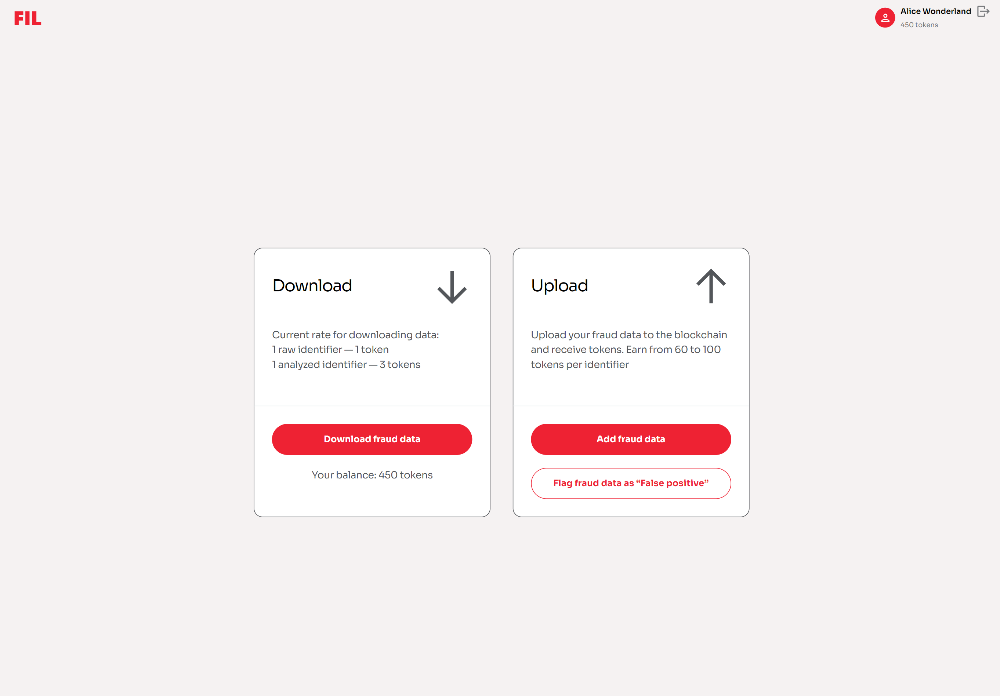
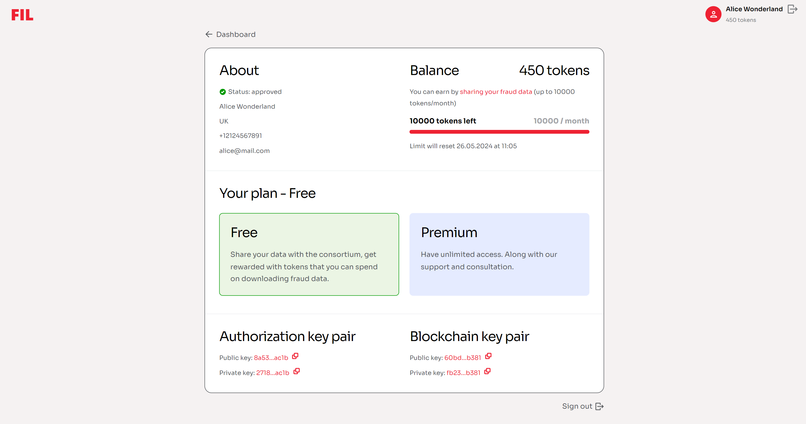

# Web App UI

Registered FIB peers and users can log in to the [FIB Web App](https://app.fraudintelligencelimited.com) using their credentials.

## Dashboard

The main screen that appears once an FIB user logs in to their Web App account.

#### Navigation

- Selecting the **Profile** button with the authorized user's first and last names takes them to the [Profile](#profile) screen.
- Selecting the **Sign out** button indicated by a door icon logs them out of the Web App.

On this screen, users can see the following tabs:

### Download

This tab displays the following elements:

- **New data entries** meter — displays the total amount of fraud events that have been contributed to the network and not yet downloaded by the signed in user.
- **Download fraud data** button — opens the **Download fraud data** screen.

See the following related tutorial:

- [Downloading fraud data](../tutorials-web/downloading-fraud-data.md)

### Upload

This tab displays the following elements:

- **Balance** meter — displays the current amount of tokens that the signed in user owns at the time of observing.
- **Add fraud data** button — opens the **Add fraud data** screen.
- **Flag fraud data as 'False positive'** button — opens the **Flag fraud data as False Positive** screen.

See the following related tutorials:

- [Uploading fraud data](../tutorials-web/uploading-fraud-data.md)
- [Flagging fraud data](../tutorials-web/flagging-fraud-data.md)

## Profile

The screen that displays the detailed information about the authorized account.

#### Navigation

- Selecting the **Dashboard** button takes the user to the [Dashboard](#dashboard) screen.
- Selecting the **Sign out** button indicated by a door icon logs them out of the Web App.

On this screen, users can see the following information about their account:

### About

This area displays the following information about the authorized account:

- Account activation status;
- First and last names;
- Country of operation;
- Phone number;
- Email address.

### Balance

This area displays the current token balance on the authorized account, the current status of the [monthly reward limit](tokenomics.md#monthly-reward-limit), as well as the timer until the next limit reset.

### Your plan

This area displays the current subscription plan on the authorized account.

To change your subscription plan, you may contact us at [support@fraudintelligencelimited.com](mailto:support@fraudintelligencelimited.com).

### 'Authorization' key pair {#akp}

Displays public and private keys of the **Authorization** key pair. These keys are unique for every user on the FIB network and are generated automatically at the time of account registration.

The public key—`authPublicKeyHex`—of this key pair is used for the following API operation:

- [Authorizing a user in the system](../api-specification/auth-controller/authorizing-a-user-in-the-system.md)

Also see the following related tutorials:

- [Authorizing an account](../tutorials-api/authorizing-an-account.md)
- [Signing user email addresses](../tutorials-api/signing-user-email-addresses.md)

### 'Blockchain' key pair {#bkp}

Displays public and private keys of the **Blockchain** key pair. These keys are unique for every user on the FIB network and are generated automatically at the time of account registration.

These keys are used for the following API operations:

- [Submitting a contribution](../api-specification/contribution-controller/submitting-a-contribution.md)
- [Submitting a contribution flag](../api-specification/contribution-controller/submitting-a-contribution-flag.md)

Also see the following related tutorials:

- [Signing transactions](../tutorials-api/signing-transactions.md)
- [Submitting a contribution](../tutorials-api/submitting-a-contribution.md)
- [Flagging a contribution](../tutorials-api/flagging-a-contribution.md)
