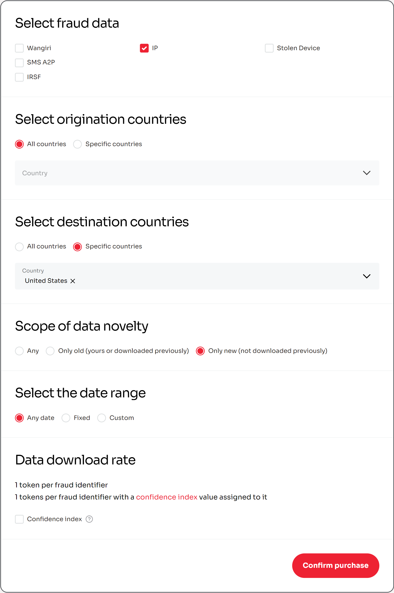
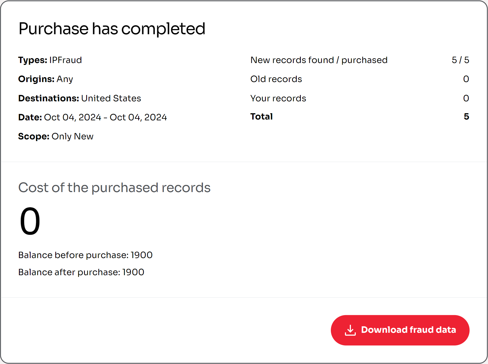
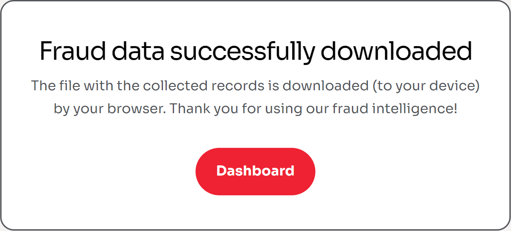

# Downloading fraud data

To download fraud event data via FIB Web App, perform the following steps:

1. On the [Dashboard](../overview/web-interface.md#dashboard) screen, select **Download fraud data** from the [Download](../overview/web-interface.md#download) tab.
2. On the **Download fraud data** screen that appears, specify the following information about the fraud event:

   - **Fraud type** — select the fraud type of the fraud events that you wish to download.\
     Multiple fraud types can be selected.
   - **Origination countries** — select the country where the fraud events originated from.\
     Multiple countries can be selected.
   - **Scope of data novelty** — select the kind of fraud events in terms of how they relate to your account.\
     Can be one of the following:
     - **Any** — all fraud events.
     - **Only old** — fraud events that either have already been downloaded or have been uploaded by your account.
     - **Only new** — fraud events that have not been downloaded previously.
   - **Date range** — if necessary, specify the timeframe that the requested fraud events are filtered by:

     - **From** box — from the pop-up calendar, select the start date that the requested fraud events are filtered by; or enter the date manually in the _DD.MM.YYYY_ format.
     - **To** box — from the pop-up calendar, select the end date that the requested fraud events are filtered by; or enter the date manually in the _DD.MM.YYYY_ format.

     ::: info

     If left unspecified, the requested fraud events will be collected since the establishment of the FIB network.

     :::

3. If necessary, select the [**Confidence index**](../overview/tokenomics.md#confidence-index) checkbox.

   

4. When ready, select **Confirm purchase**.
5. On the **Purchase has completed** screen that appears, select **Download fraud data**.

   

### Expected result

The fraud events data, filtered according to your specified criteria, is downloaded to your device as a `.csv` file, which can be opened using any spreadsheet software available to you (e.g., Microsoft Excel, Google Sheets); and the [token balance](../overview/web-interface.md#balance) of the signed-in user is decreased based on the current conversion rate active in the network (see [Current conversion rate](../overview/tokenomics.md#current-conversion-rate)).

::: info

For more information on fraud event data, including fraud identifiers, fraud types, and other relevant concepts, see [Fraud events](../overview/fraud-events.md) and [Contributions](../overview/contributions.md).

:::

#### .CSV file template

In the downloaded `.csv` file each row of the table contains a single fraud event entry saved in a single cell. Each entry adheres to the following data format:

`Fraud type`, `Fraud Identifier` (Number or range of numbers), `Origination country two-letter code` ([ISO 3166](https://www.iso.org/iso-3166-country-codes.html), Alpha-2), `Destination country two-letter code` ([ISO 3166](https://www.iso.org/iso-3166-country-codes.html), Alpha-2)
