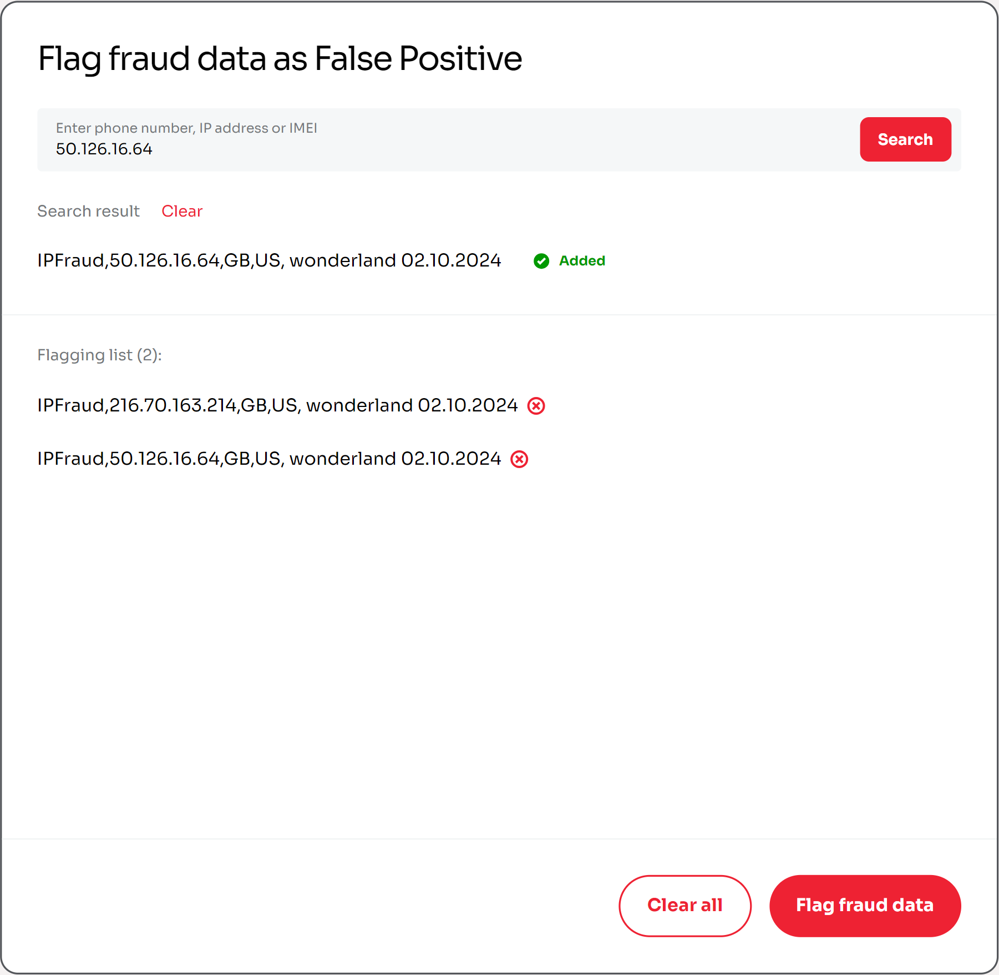
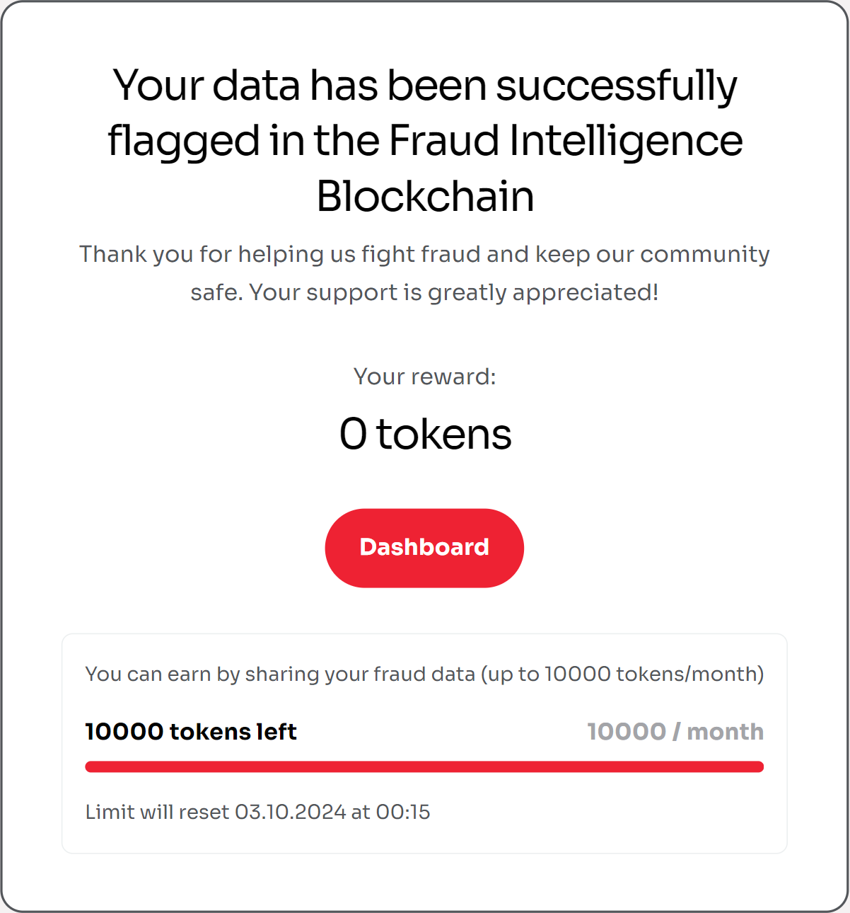

# Flagging fraud data

To flag fraud event data via FIB Web App, perform the following steps:

1. On the [Dashboard](../overview/web-interface.md#dashboard) screen, select **Flag fraud data as "False positive"** from the [Upload](../overview/web-interface.md#upload) tab.
2. On the **Flag fraud data as False Positive** screen that appears, look up the fraud event(s) that you wish to flag by using the **Search** bar (only accepts phone numbers, IP addresses and IMEI).
3. From the list of results, select **Add to flagging list** next to every entry that you wish to flag.
4. When ready, select **Flag fraud data**.

{data-zoomable .mini}

### Expected result

{data-zoomable .mini}

The status of the selected fraud event(s) is set to `Flagged`, and the submitting peer is rewarded with tokens.

::: tip NOTE

Flagging contributions uploaded by the same peer does not provide token rewards.

:::
